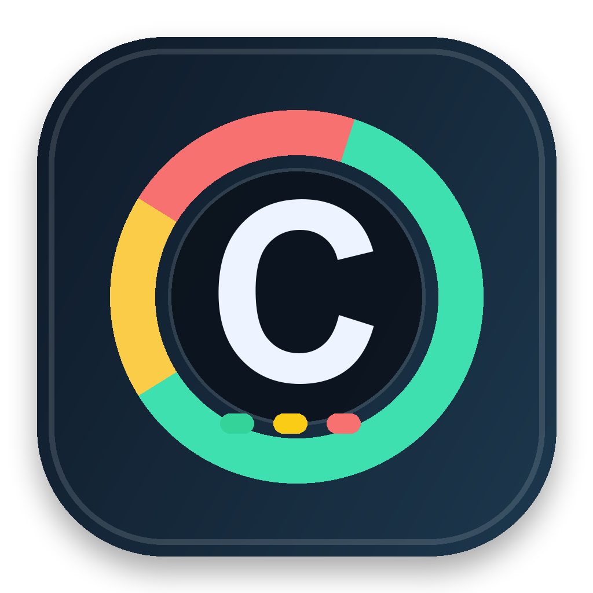

<p align="center">
  
</p>

# Usage Monitor

A desktop companion for keeping an eye on your Codex account quota. See what is left, when each window resets, and how your usage is trending from the Windows system tray or macOS menu bar.

[](LICENSE)


An independent community project built with C# and Avalonia.

## Features

- **Quota at a glance:** remaining percentages, reset times in local time, plan information, and multiple limit groups when supplied by Codex.
- **Tray status:** green, yellow, orange, or red according to the primary Codex window's remaining quota; gray when quota is unavailable. On macOS, the Dock icon also shows status and a percentage badge.
- **Automatic refresh:** every 1, 5, 15, or 30 minutes, with a 5-minute default and a manual refresh action.
- **History charts:** roughly two weeks of recorded quota, reset markers, and a projected usage line. Samples are retained locally for 15 days.
- **Depletion forecasts:** estimates of whether a window will run out before its next reset, with a confidence indicator.
- **Last known values:** a failed refresh leaves the previous quota visible and shows an error alongside the last update time.

Forecasts are estimates based on sampled quota changes. History accumulates while Usage Monitor is running; gaps while the app is closed are expected.

## Requirements

To run a packaged app:

- Windows x64, or macOS on Apple Silicon or Intel, using an OS version compatible with .NET 9, Avalonia, and your installed Codex version.
- A locally installed Codex CLI and a signed-in ChatGPT account that provides Codex account rate-limit data.
- An internet connection for Codex to refresh account limits.

To build from source, also install the [.NET 9 SDK](https://dotnet.microsoft.com/en-us/download/dotnet/9.0), or a newer SDK capable of targeting `net9.0`. Running a framework-dependent build requires the .NET 9 runtime. The self-contained packages described below include that runtime.

The project currently targets .NET 9. Microsoft lists its end of support as November 10, 2026; see the [.NET support policy](https://dotnet.microsoft.com/en-us/platform/support/policy/dotnet-core) when planning maintained releases.

## Set up Codex

Install Codex using the [official CLI installation guide](https://learn.chatgpt.com/docs/codex/cli#getting-started). The standalone installers provide a native executable suitable for this app.

### Windows

Run the official installer in PowerShell:

```powershell
powershell -ExecutionPolicy ByPass -c "irm https://chatgpt.com/codex/install.ps1 | iex"
```

Open a new PowerShell window, then verify the executable and sign in:

```powershell
where.exe codex.exe
codex.exe login
```

Usage Monitor searches `PATH` for **`codex.exe`**. An npm `codex.cmd` shim or a Codex installation inside WSL alone does not satisfy that lookup. Restart Usage Monitor after installing Codex or changing `PATH`.

### macOS

Install the standalone CLI from Terminal:

```bash
curl -fsSL https://chatgpt.com/codex/install.sh | sh
```

Open a new Terminal window, then sign in:

```bash
codex login
```

On macOS, Usage Monitor first looks for a runnable bundled CLI in `ChatGPT.app` or `Codex.app` under `/Applications` or `~/Applications`, then falls back to `codex` on `PATH`. The app also checks common Homebrew and Node installation directories. Temporary `npx` cache installations are excluded.

Use **Sign in with ChatGPT** for account quota monitoring. See [OpenAI's authentication documentation](https://learn.chatgpt.com/docs/auth#codex-cli) for sign-in help.

## Run from source

```bash
git clone https://github.com/I4-PJ/UsageMonitor.git
cd UsageMonitor
dotnet run --project UsageMonitor.csproj
```

Look for the tray or menu-bar icon after launch. Click it, or choose **Show Details** from its menu, to open the dashboard. **Refresh Now** requests a fresh reading. Closing the dashboard keeps the monitor running; choose **Quit** from the tray menu to exit.

## Deploy on Windows

Run these commands from the repository root in PowerShell. Quit any instance running from your build directory before rebuilding.

### Build a portable package

```powershell
dotnet publish UsageMonitor.csproj --configuration Release --runtime win-x64 --self-contained true -p:PublishSingleFile=false -p:PublishTrimmed=false --output ./artifacts/publish/win-x64
Compress-Archive -Path ./artifacts/publish/win-x64/* -DestinationPath ./artifacts/UsageMonitor-win-x64.zip -Force
```

The ZIP contains the executable, application dependencies, .NET runtime, and MIT license. Distribute the entire ZIP or publish directory; the executable needs the other files alongside it. See Microsoft's [deployment documentation](https://learn.microsoft.com/en-us/dotnet/core/deploying/) for the distinction between self-contained and framework-dependent builds.

### Install and launch

1. Extract `artifacts/UsageMonitor-win-x64.zip` into a permanent folder, such as `%LOCALAPPDATA%\Programs\UsageMonitor`.
2. Install native Codex and sign in as the Windows user who will run Usage Monitor.
3. Launch `UsageMonitor.exe`. The app appears in the system tray, which may be inside the hidden-icons menu.
4. Optionally create a shortcut to the executable. To start at sign-in, place that shortcut in the folder opened by **Win + R** → `shell:startup`.

For an update, choose **Quit**, replace the application files with the new package, and relaunch. Settings and quota history are stored separately from the installation folder.

These commands produce a portable folder, without an installer or code signature. Signing a public Windows release requires a separate signing step and a suitable certificate.

## Deploy on macOS

Build the application bundle **on a Mac** with the .NET SDK installed. The packaging script uses macOS tools and creates a self-contained `.app` containing the runtime, dependencies, icons, launcher, and MIT license.

### Choose the architecture

| Mac | Runtime | Build command |
| --- | --- | --- |
| Apple Silicon | `osx-arm64` | `bash scripts/package-macos.sh osx-arm64` |
| Intel | `osx-x64` | `bash scripts/package-macos.sh osx-x64` |

Running `bash scripts/package-macos.sh` without an argument defaults to Apple Silicon. The script creates `artifacts/macos/UsageMonitor.app` and replaces that bundle on each run. Package or copy the result before building the other architecture.

For example, build and archive an Apple Silicon version:

```bash
bash scripts/package-macos.sh osx-arm64
ditto -c -k --sequesterRsrc --keepParent artifacts/macos/UsageMonitor.app artifacts/UsageMonitor-osx-arm64.zip
```

For Intel, use `osx-x64` in the build command and ZIP filename. These are separate architecture-specific packages.

### Install and launch

1. Extract the matching ZIP and drag `UsageMonitor.app` to `/Applications`, or to your own `~/Applications` folder.
2. Install or open Codex and sign in as the macOS user who will run Usage Monitor.
3. Open `UsageMonitor.app` from Finder. Use the menu-bar icon to show the dashboard or quit the app.
4. Optionally add the app in **System Settings** → **General** → **Login Items** to start it at sign-in.

For a local build, you can also launch it directly:

```bash
open artifacts/macos/UsageMonitor.app
```

The packaging script does not perform Developer ID signing or notarization. For public binary distribution, sign the completed bundle, notarize it, and staple the notarization ticket before creating the final ZIP. If macOS blocks a trusted local build, follow Apple's [instructions for opening an unsigned or unnotarized app](https://support.apple.com/en-us/102445).

Quit the app before replacing an installed bundle during an update. The bundled launcher prevents a second `UsageMonitor.real` instance from starting.

## How quota is read

Each refresh starts the installed CLI as a short-lived `codex app-server` process, initializes its JSON-RPC connection over standard input/output, and calls `account/rateLimits/read`. Usage Monitor supports both the multi-group `rateLimitsByLimitId` response and the older `rateLimits` response.

The app uses Codex's existing authentication. It requests account limits without creating a coding task or consuming a quota reset credit. This is account quota monitoring; API token billing and per-chat token accounting are outside its scope. See the [Codex App Server documentation](https://learn.chatgpt.com/docs/app-server) for the underlying protocol.

## Local data and privacy

Usage Monitor writes its own settings and quota samples under the current user's application-data directory:

| Platform | Default directory |
| --- | --- |
| Windows | `%APPDATA%\UsageMonitor\` |
| macOS | `~/Library/Application Support/UsageMonitor/` |

- `settings.json` stores the refresh interval.
- `quota-history.jsonl` stores sample timestamps, limit names and IDs, window durations, reset times, and used percentages. Older samples are periodically removed according to the 15-day retention period.

Usage Monitor does not copy Codex credentials or conversation content into these files and has no separate telemetry or upload service. The installed Codex process communicates with OpenAI to obtain account limits and follows its own configuration.

To clear history or reset settings, quit Usage Monitor and delete the corresponding file. The app recreates it when needed.

## Troubleshooting

| Symptom | What to check |
| --- | --- |
| Codex CLI was not found | On Windows, check `where.exe codex.exe`; on macOS, check the bundled app location or `command -v codex`. Restart Usage Monitor after changing `PATH`. |
| Installed Codex command is incomplete | Update or reinstall Codex using the official standalone installer. |
| Sign-in errors or unavailable quota | Complete `codex login` with ChatGPT as the same OS user, check connectivity, and refresh again. Available limits depend on the account and CLI response. |
| Refresh times out | A refresh has a 45-second timeout. Check connectivity and the installed Codex version, then retry. |
| Learning usage pattern | Keep the app running so it can collect samples. A future reset time and measurable usage are needed to estimate depletion. |
| History cannot be saved | Check write access to the application-data directory and available disk space. |
| Build cannot overwrite `UsageMonitor.exe` | Choose **Quit** from the running app's tray menu before rebuilding. |

### Diagnostic probe

To read quota without starting the desktop UI:

```bash
dotnet run --project UsageMonitor.csproj -- --probe
```

The probe writes `UsageMonitor.probe.txt` into the OS temporary directory and attempts to print the same result to standard output. For the packaged Windows app, use `UsageMonitor.exe --probe`; for a macOS bundle, invoke `UsageMonitor.app/Contents/MacOS/UsageMonitor.real --probe` directly. Review the diagnostic file before sharing it: it can contain quota data, local paths, and error details. The probe writes failures to that file, so process exit status alone does not establish success.

## Development and contributions

```bash
dotnet build UsageMonitor.csproj --configuration Release
dotnet test UsageMonitor.Tests/UsageMonitor.Tests.csproj --configuration Release
```

The xUnit tests cover CLI discovery, quota history persistence, forecasting, and refresh-error behavior. They use fixtures and temporary files rather than requiring a live Codex account.

Report bugs or propose improvements through [GitHub issues](https://github.com/I4-PJ/UsageMonitor/issues). Include the OS, architecture, Codex version, and steps to reproduce. Pull requests are welcome; keep changes focused and run the relevant tests.

## License

Copyright © 2026 Petr Jílek. Licensed under the [MIT License](LICENSE).

MIT permits use, modification, and redistribution, including commercial use, provided its copyright and permission notice are retained. See the [standard MIT license](https://spdx.org/licenses/MIT.html) for the full terms. Third-party dependencies retain their own licenses; Codex and OpenAI names remain the property of their respective owners.
